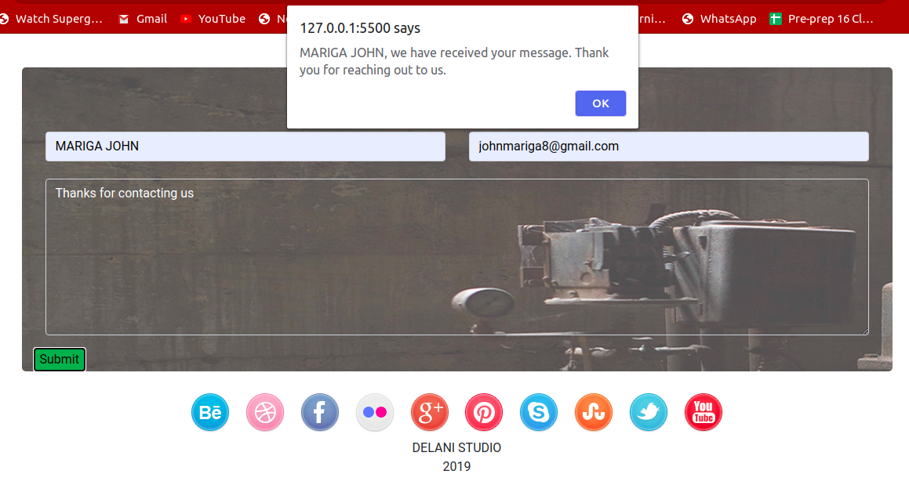
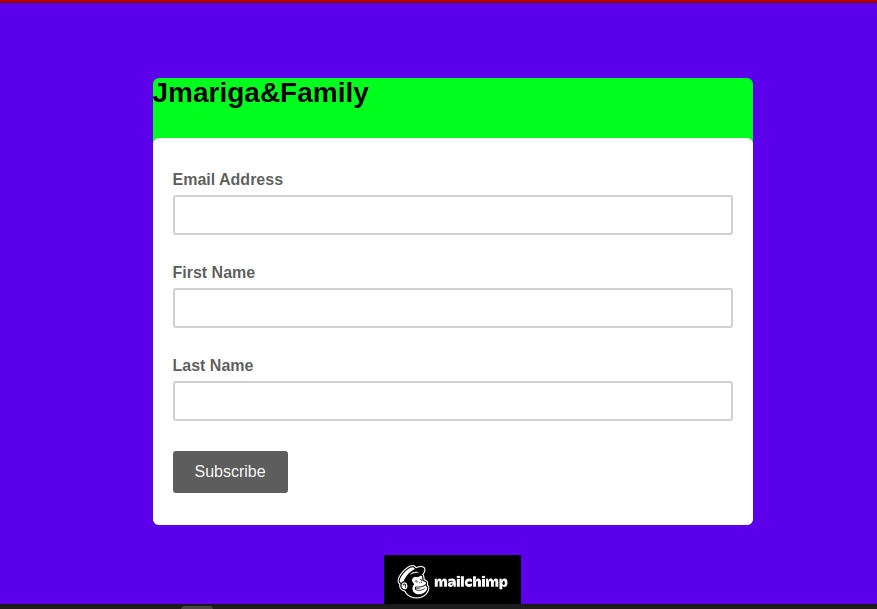

# DELANI STUDIO 
## AUTHOR
 MARIGA JOHN
## Description
* This is a project that displays what Delani Studio does and its landing page. Additionally, it allows users to send messages and  receive alert confirmations upon subscription to the company.
## Expectation of the Page
### landing page

This is the landing page of Delani Studio.

### Interface with the form

This is the interface for the user on how to fill the form and the expected outcome.

### Subscription Form

This is a form for user to subscribe to delani studio services.

### To run my page on your browser,
* Download the zip codes from my git account.
* Extract the zip file to your folder directory documents or desktop.
* Open the folder saved using Visual studio or Atom.
* To render the page on your browser,Go live with your server.
* Edit codes and push it to github
### Known Bugs
* Working on responsiveness of the form filled by users to make it more interactive .
* Link mailchimp to the form after alerting the user we have recived their feedback.
## Technologies Used
* HTML
* CSS
* Bootstrap
* javascript
### Support and contact details
* email @ johnmariga8@gmail.com
* 0742249975
* fb @zellyjones
* instagram @ Mariga john
### License
licensed under [MIT license](LICENSE)